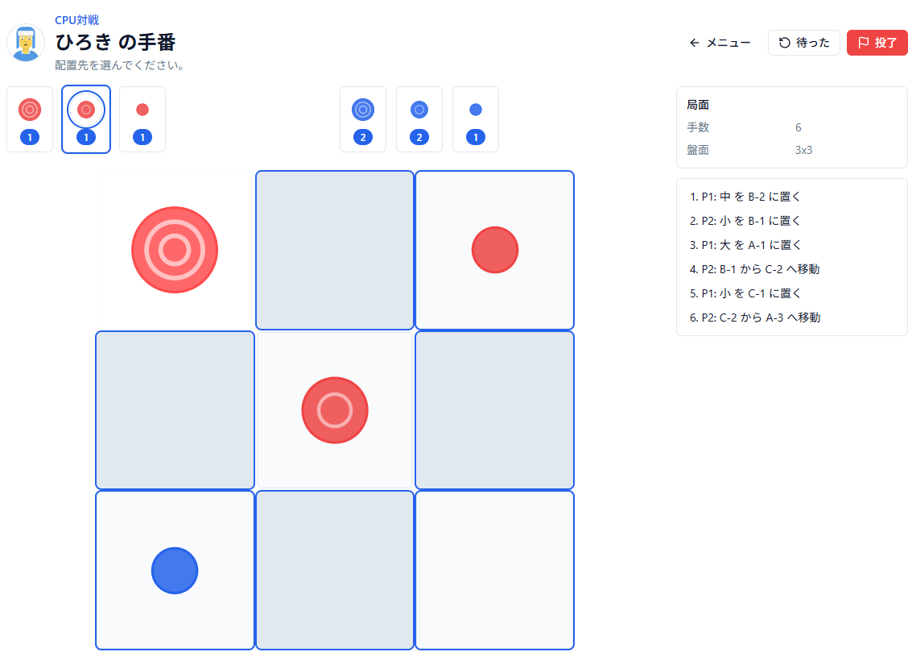
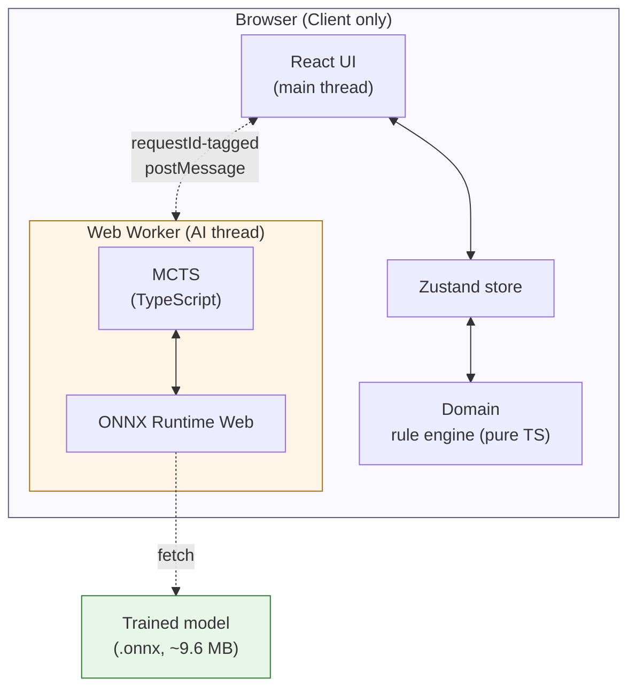

# Dynamic Tic-Tac-Toe

> Gobblet を題材にした戦略ボードゲームの Web 実装。AlphaZero 系の強化学習による CPU 対戦を搭載。

## 🚀 Play now → https://h-seno-tokai.github.io/dynamic-tic-tac-toe/

---

🇬🇧 **English summary** (日本語版は下):

> A web implementation of "Dynamic Tic-Tac-Toe", a Gobblet-inspired strategic board game featuring local 2-player and 10-tier CPU opponents trained via **AlphaZero-style self-play reinforcement learning** (PyTorch on RTX 2080). Inference runs **entirely in the browser** via ONNX Runtime Web with a custom MCTS in a TypeScript Web Worker — no backend, no server cost, hosted on GitHub Pages. Frontend: React 18 + Vite + Tailwind CSS + Framer Motion + Howler.js. Model: 8×128ch ResNet (~2.4M params, ~9.6 MB ONNX float32).

---

## ゲーム紹介

「Dynamic Tic-Tac-Toe」は、ボードゲーム **Gobblet（ゴブレット）** を題材にした Web ゲームです。

大・中・小のサイズが異なる駒を使い、**相手の駒を覆い被せながら**一列を目指す頭脳戦です。ただ置くだけでなく、盤上の駒を動かして局面を崩すことが戦略の核心です。

- **ローカル2人対戦**：同じ端末で交互に手を進める
- **CPU対戦**：AlphaZero 系の強化学習で自己対戦から学習した AI（難易度 10 段階）に挑む
- **2 つのルール**：3×3 クラシック（大・中・小）/ 4×4 巨大入り（巨大・大・中・小）

ML モデルはローカル GPU（RTX 2080）で事前学習し、ブラウザ内で **ONNX Runtime Web** により推論します。サーバ不要、GitHub Pages のみで完結します。

## 特徴

- 🎯 **ローカル2人対戦 / CPU対戦**（難易度 10 段階）
- 🤖 **AlphaZero 系強化学習**：自己対戦のみで学習（完全教師無し）
- 🧠 **ブラウザ内 ML 推論**：ONNX Runtime Web + TypeScript MCTS in Web Worker
- 🧩 **高品質 ResNet モデル**：約 2.4M params / ~9.6 MB ONNX（8 ブロック × 128ch）
- ⚙️ **2 プリセットルール**：3x3 クラシック / 4x4 巨大入り
- 🎨 **テーマ**：ダーク / ライト（OS 設定尊重）
- 📱 **モバイル対応**：レスポンシブ + タッチ操作
- 🔊 **BGM・効果音**：Howler.js による音声再生
- 📲 **PWA 対応**：ホーム画面へのインストール可能
- ♿ **アクセシビリティ**：WCAG 2.1 AA レベル目標（キーボード操作・aria 属性）
- 🌐 **日本語 / 英語** 対応

## アーキテクチャ

| レイヤ         | 技術                            |
| -------------- | ------------------------------- |
| フロントエンド | React 18 + TypeScript + Vite    |
| 状態管理       | Zustand                         |
| スタイル       | Tailwind CSS + CSS variables    |
| アニメーション | Framer Motion                   |
| 音声           | Howler.js                       |
| ML 推論        | ONNX Runtime Web                |
| ML 学習        | PyTorch（オフライン、RTX 2080） |
| ホスティング   | GitHub Pages                    |
| CI/CD          | GitHub Actions                  |

## 設計ドキュメント

要件定義から実装・デプロイまでの設計成果物を `docs/` に集約しています。

- [📑 設計ドキュメント インデックス](docs/README.md)
- [01. 要件定義](docs/01_requirements.md) — 機能・非機能要件・スコープ
- [02. 未決事項リスト](docs/02_open_questions.md)
- [03. アーキテクチャ](docs/03_architecture.md) — 8 個の ADR を含む
- [04. 技術スタック](docs/04_tech_stack.md)
- [05. UI 設計](docs/05_ui_design.md)
- [06. データモデル](docs/06_data_model.md) — ルール駆動の拡張性設計
- [07. CPU / 強化学習設計](docs/07_ai_design.md) — **AlphaZero ネットワーク詳細（4×4×27 入力 / ResNet 8×128 / 320 行動空間 / 10 段階難易度）**
- [08. アセット計画](docs/08_assets.md)
- [09. コーディング規約](docs/09_conventions.md) — 汎用性最大化のコンポーネント設計指針
- [10. リスク管理](docs/10_risks.md) — 実装前レビューの指摘と緩和策

## ライセンス

[MIT License](LICENSE)
