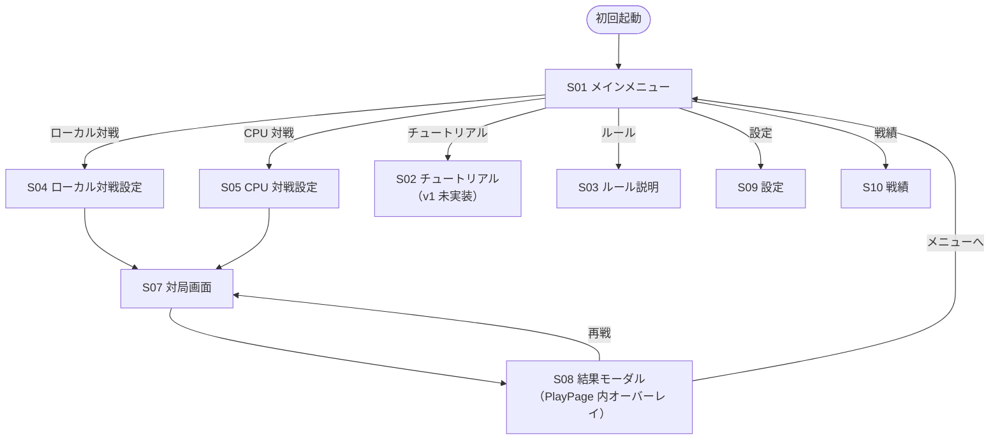

# 05. UI 設計

## 1. 画面一覧

| ID  | 画面名                             | 主要機能                                                    | 経路                                              |
| --- | ---------------------------------- | ----------------------------------------------------------- | ------------------------------------------------- |
| S01 | タイトル / メインメニュー          | モード選択（ローカル / CPU / チュートリアル / 設定 / 戦績） | `/#/`                                             |
| S02 | チュートリアル（オンボーディング） | **v1 未実装**。ルール説明画面（S03）で代替。                | —                                                 |
| S03 | ルール説明                         | メニューから常時アクセス可能なルール解説                    | `/#/rules`                                        |
| S04 | ローカル2人対戦設定                | プレイヤー名入力・アバター選択・ルール設定                  | `/#/local/setup`                                  |
| S05 | CPU対戦設定                        | 難易度（10段階）・先手後手・ルール設定                      | `/#/cpu/setup`                                    |
| S06 | ルールプリセット選択               | 2択ラジオ（3x3 クラシック / 4x4 巨大入り）                  | モーダル内コンポーネント                          |
| S07 | 対局画面                           | 盤面・駒スタック・操作（投了/待った/履歴）・思考時間表示    | `/#/play`                                         |
| S08 | 結果画面                           | 「勝負あり！」演出 / 勝敗表示 / 再戦・メニューへ            | PlayPage 内モーダルオーバーレイ（独立ルートなし） |
| S09 | 設定                               | BGM/SFX 音量・言語・テーマ・戦績クリア                      | `/#/settings`                                     |
| S10 | 戦績                               | 難易度別勝敗・最終対局日                                    | `/#/stats`                                        |

## 2. 画面遷移図

## 3. 主要 UX フロー

### 3.1 初回起動フロー

1. アプリロード（ゲーム本体のみ、~10MB 以内）
2. S01 メインメニュー（チュートリアルは v1 未実装）
3. CPU対戦を選択した時点で ONNX モデル（~9.6MB）を遅延ロード

### 3.2 CPU対戦フロー

1. S01 → CPU対戦選択
2. S05 で難易度・先手後手・ルール選択（戻る可）
3. S07 対局
   - プレイヤー手番: マス選択 → 駒選択（手駒 or 盤面） → 配置先選択
   - CPU手番: 思考中インジケータ + 経過時間表示 + キャンセル不可（投了は可）
   - 「待った」: 直前の自分の手を取り消し（CPU手番中は無効）
4. 終局 → S07 内モーダル（S08）→ 効果音演出 → 再戦 / メニュー

### 3.3 ローカル2人対戦フロー

1. S01 → ローカル対戦選択
2. S04 でプレイヤー1/2 の名前入力 + アバター選択（既定値あり）+ ルール選択
3. S07 対局
   - 「待った」は同卓合意の前提で常時許可
4. 終局 → S07 内モーダル（S08）→「勝負あり！」演出 → 勝者名アバター強調 → 再戦 / メニュー

### 3.4 ルール選択フロー

- S04/S05 の対戦設定画面で 2 択ラジオを表示（モーダル不要、インラインで OK）
- 選択肢:
  - 3x3 クラシック: 大中小 各2個（既定）
  - 4x4 巨大入り: 巨大・大中小 各3個
- 完全カスタム UI は無いため、バリデーション不要

## 4. レスポンシブ方針

- ブレイクポイント:
  - モバイル: 〜 640px
  - タブレット: 641〜1024px
  - デスクトップ: 1025px〜
- 盤面: 短辺基準で正方形を確保。タッチ領域は最低 44x44px（iOS HIG 基準）。
- メニュー: モバイルは縦スクロール、デスクトップはグリッド。
- 設定モーダル: モバイルではフルスクリーン、デスクトップではダイアログ。

## 5. アニメーション方針

- **微細**: 駒のホバー、ボタン押下、メニュー遷移（Framer Motion の spring）
- **強調**: 駒移動・覆い被せ・「勝負あり！」演出
- `prefers-reduced-motion` を尊重し、モーション軽減モードでは fade のみに簡略化

## 6. テーマ

- ダーク / ライト の2種
- CSS variables で色定義、`data-theme="dark"` 属性でルート切替
- Tailwind の `dark:` バリアントは使わず CSS 変数経由で統一（テーマ追加が将来的に楽）
- 初期値: `prefers-color-scheme`、ユーザー切替を localStorage 永続化

## 7. アクセシビリティ実装メモ

- すべての操作にキーボード経路あり
- 盤面: 矢印キーでフォーカス移動、Enter/Space で選択
- 駒・マスに `aria-label`（「中サイズの駒、プレイヤー1」「マス B-2、空」等）
- フォーカスリングを CSS で常時可視化（`:focus-visible`）
- ライブリージョンで CPU 思考完了・勝敗を読み上げ通知
