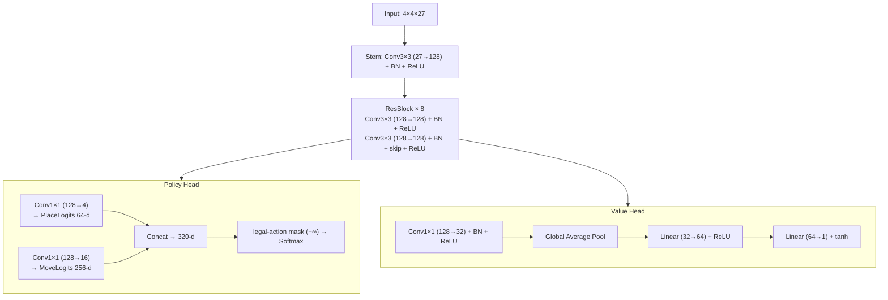

# 07. CPU / 強化学習の設計

## 1. 基本方針

### 1.1 アルゴリズム: AlphaZero系

- **完全教師無し**で学習する（自己対戦のみ）
- Policy + Value 二頭ネットワーク + MCTS（モンテカルロ木探索）
- 学習済みネットを ONNX 形式で書き出し、ブラウザで推論

採用理由:

- ユーザー要件「完全教師無し」と整合（NNUE系は実質的に教師付き）
- Gobblet級の状態空間なら RTX 2080 で家庭用GPU範囲で学習可能
- 1つのネットから複数難易度を派生できる（後述）
- 「AlphaZeroをWebで動かした」というポートフォリオ価値が高い

### 1.2 学習・推論の分離

- **学習**: ローカル（RTX 2080）+ Python + PyTorch
- **配信**: 学習済み重みを ONNX 形式でリポジトリ or 静的ホスティング上に置く
- **推論**: ブラウザ上で ONNX Runtime Web により実行
- **MCTS**: TypeScript で自前実装してクライアント側で動かす

### 1.3 CPU難易度の作り分け方針（10段階）

1ネットワークを学習し、推論時パラメータで難易度を派生させる：

| 難易度 | チェックポイント       | MCTS sim数 | 温度       | 応答時間目安 |
| ------ | ---------------------- | ---------- | ---------- | ------------ |
| 1      | 学習超初期 or ランダム | ~20        | 高         | ~1s          |
| 2      | 学習初期               | ~50        | 高         | ~1s          |
| 3      | 学習初期               | ~100       | 中高       | ~1.5s        |
| 4      | 学習中期               | ~150       | 中高       | ~2s          |
| 5      | 学習中期               | ~250       | 中         | ~3s          |
| 6      | 学習中期               | ~400       | 中         | ~4s          |
| 7      | 学習後期               | ~600       | 中低       | ~5s          |
| 8      | 学習後期               | ~1000      | 低         | ~7s          |
| 9      | 最終                   | ~1500      | 低         | ~9s          |
| 10     | 最終                   | ~3000      | 0 (greedy) | ~10s         |

数値は実測しながら最終調整する。

### 1.4 マルチルール対応（ユニバーサルネットワーク方式）

**要件**: ユーザーがルールをカスタムしても同一の AI モデルで対戦できるようにする。

#### 1.4.1 想定スコープ（2 プリセット固定）

- 対象は 2 プリセットのみ:
  - **3x3 クラシック**: 3x3、大中小 各2個
  - **4x4 巨大入り**: 4x4、巨大・大・中・小 各3個
- 共通の MAX 値:
  - **MAX_BOARD = 4**
  - **MAX_PIECE_SIZES = 4**
  - **MAX_PIECES_PER_SIZE = 3**
- 4x4 巨大入りプリセットを完全カバー。完全カスタム UI は提供しないため、上限超のルールは存在しない。

#### 1.4.2 ネットワーク設計の制約

ユーザーが決めるモデルアーキテクチャの制約条件として:

- 入力テンソルは **固定形状** `MAX_BOARD × MAX_BOARD × 27 ch`（詳細チャネル設計は §2.1）
  - 最上段位置 (size × player): 8 ch
  - 任意位置 (被覆含む、size × player): 8 ch
  - 手駒残数 (size × player、空間ブロードキャスト): 8 ch
  - 手番 / out-of-board / unused-size: 各 1 ch
- バックボーンは **Fully Convolutional** を推奨（盤面サイズへの感度を抑制）
- ポリシーヘッド: 出力次元 320 固定
  - PlaceFromReserve: 4 × 16 = 64
  - MoveOnBoard: 16 × 16 = 256
- バリューヘッド: Global Average Pool → 1次元 → tanh

#### 1.4.3 行動マスキング

推論時に現ルールの **合法手以外を −∞ でマスク** してから softmax。
学習時のターゲット方策（MCTS の访問回数分布）も合法手のみで正規化。

#### 1.4.4 学習方針（2 プリセット混合）

- 自己対戦のたびにプリセットをサンプリング
- サンプリング比率の初期値: **3x3 クラシック 50% / 4x4 巨大入り 50%**
  - 学習中に観察される棋力差で 60/40 等に調整
- リプレイバッファは両プリセット混合
- 損失は標準 AlphaZero（policy CE + value MSE）

#### 1.4.5 バックボーン選択（補足）

**Fully Convolutional Network を採用、Transformer は不採用**。
理由: 盤面が小さく self-attention の利点が出ない / CNN の空間 inductive bias が連続マス勝利判定に直接効く / サンプル効率と推論コストで CNN 優位 / AlphaZero 標準実装との整合。

#### 1.4.6 期待品質と劣化時の対処

- 2 プリセットそれぞれで最強難易度として通用するレベルを目標
- 一方が伸び悩む場合: そのプリセットのサンプリング比率を増やしてファインチューニング
- 学習コスト: 単一プリセット学習より 1.3〜1.5 倍程度を見込む（RTX 2080 で実用範囲）

#### 1.4.7 段階的開発の余地（フォールバック）

学習時間が足りない場合:

- Phase A: 3x3 クラシックのみ学習・公開
- Phase B: 後日、4x4 巨大入りも含めて再学習・モデル更新

Phase A 段階で公開する場合、4x4 プリセットは「2人対戦のみ・CPU は近日対応」と表記。

---

## 2. ネットワークアーキテクチャ

### 2.0 設計目標

- ONNX サイズ < 12MB（モバイル含めた高速ロード）
- 推論時間 < 15ms / forward pass（モデル規模拡大のため）
- 学習が RTX 2080 で実用範囲（1〜2週間）に収まる

### 2.1 入力テンソル（4 × 4 × 27）

| ch 範囲 | 内容                                                           | 数        |
| ------- | -------------------------------------------------------------- | --------- |
| 0–3     | P1 駒の **最上段** 位置（サイズ別 one-hot）                    | 4         |
| 4–7     | P2 駒の **最上段** 位置（サイズ別 one-hot）                    | 4         |
| 8–11    | P1 駒の **スタック内任意位置**（被覆含む、サイズ別）           | 4         |
| 12–15   | P2 駒の **スタック内任意位置**（同上）                         | 4         |
| 16–19   | P1 手駒残数（サイズ別、空間ブロードキャスト、正規化済み 0..1） | 4         |
| 20–23   | P2 手駒残数（同上）                                            | 4         |
| 24      | 手番（P1=1, P2=0）                                             | 1         |
| 25      | out-of-board mask（盤外マスを 1）                              | 1         |
| 26      | unused-size mask（現プリセットで未使用のサイズを 1）           | 1         |
| 計      |                                                                | **27 ch** |

「最上段」と「任意位置」の2系統で、**駒の被覆関係**を網羅的に表現する。これにより MCTS ルートからの「持ち上げて移動」の合法性をネットが学習可能。

### 2.2 ネットワーク構造（ResNet）



アーキテクチャ定数:

```
TRUNK_CHANNELS  : 128
NUM_RES_BLOCKS  : 8
```

**ヘッドの conv 化** は重要決定:

- PlaceHead: `Conv1×1(128→4)` → 出力 4×4×4 = 64 logits（4 sizes × 16 cells）
- MoveHead: `Conv1×1(128→16)` → 出力 4×4×16 = 256 logits（16 to-cells × 16 from-cells）
- dense 層を排除して位置依存性を保持、汎化性能とパラメータ削減を両立

### 2.3 パラメータ概算

| ブロック                    | パラメータ                     |
| --------------------------- | ------------------------------ |
| Stem                        | 27 × 128 × 9 ≈ 31K             |
| ResBlock × 8                | 8 × 2 × 128 × 128 × 9 ≈ 2,360K |
| Policy Heads (Place + Move) | 128 × (4 + 16) ≈ 2.6K          |
| Value Head                  | 128 × 32 + 32 × 64 + 64 ≈ 6.3K |
| **合計**                    | **約 2.4M params**             |

**ONNX 想定サイズ**: 約 9.6 MB (float32) / 約 2.4 MB (int8 量子化後)

> 設計当初の 316K 4×64 ResNet は棋力が不足したため、8×128ch に増強した。

### 2.4 学習ハイパーパラメータ初期値

| 項目                              | 値                                          |
| --------------------------------- | ------------------------------------------- |
| 自己対戦並列度                    | 16（GPU バッチ評価、single-process モード） |
| 学習バッチサイズ                  | 256                                         |
| 総学習ステップ数                  | 1500                                        |
| 最適化                            | AdamW (lr=1e-3, weight_decay=1e-4)          |
| LR スケジュール                   | cosine annealing                            |
| MCTS シミュレーション数（学習時） | 200                                         |
| 探索温度（学習序盤）              | 1.0                                         |
| 探索温度（学習終盤）              | 0.5（25 手目以降は 0 に近づける）           |
| Dirichlet ノイズ                  | α=0.3, ε=0.25                               |
| リプレイバッファ                  | 20,000 positions（FIFO）                    |
| ターゲットネット更新頻度          | 1000 train steps                            |
| プリセットサンプル比              | 3x3:4x4 = 50:50（最終学習値）               |

### 2.5 量子化方針

1. まず float32 で学習・配信。動作・棋力を確認
2. ロード時間または推論速度に問題があれば ONNX Runtime Web の動的 int8 量子化を適用
3. int8 で棋力が顕著に劣化する場合は量子化見送り（モバイル 10秒予算は float32 でも余裕の見込み）

### 2.6 設計決定の根拠

- **ResNet（8 ブロック・128 ch）**: 初期の 4×64 構成では棋力不足だったため 8×128 に増強。AlphaGo Zero の 19×19 用 39 ブロック・256 ch から 1/40 規模で十分な棋力に到達。
- **入力 27 ch（最上段 + 任意位置）**: Gobblet 系で必要な「被覆関係」を表現する最小構成。
- **conv ベースの policy head**: 位置依存性を保ちつつパラメータ最小化。AlphaGo Zero 系の標準パターン。

---

## 3. 実装詳細

### 3.1 学習フレームワーク

- **PyTorch**
- 理由: ONNX エクスポート経路が素直、コミュニティ豊富

### 3.2 推論ランタイム

- **ONNX Runtime Web**
- 理由:
  - PyTorch → ONNX が標準サポート
  - WebGPU / WASM 両バックエンド対応 → モバイル含めて性能を出せる
  - TensorFlow.js より PyTorch との接続が綺麗

### 3.3 MCTS 実装

- **TypeScript で自前実装**
- 探索木はメモリ上のオブジェクトグラフ
- ノードあたり: 訪問回数 N、累積価値 W、事前確率 P、子ノード参照
- UCB1（PUCT）で行動選択、ネットワーク呼び出しはバッチ化を検討

### 3.4 自己対戦インフラ

- Python 側で複数並列に自己対戦実行（multiprocessing）
- リプレイバッファに局面・方策ターゲット・最終結果を蓄積
- 一定ステップごとにネットを更新、新旧で対戦して採用判定

### 3.5 学習〜配信パイプライン

1. Python で学習・チェックポイント保存
2. 採用するチェックポイントを `torch.onnx.export` で ONNX 化（**model.eval() 必須**）
3. opset 17 固定、dynamic_axes は使わない（入力 4×4×27 で固定）
4. 配信先（`public/models/` 配下）に配置 → GitHub Actions で公開
5. クライアントは fetch + ONNX Runtime Web で読込

### 3.6 ONNX 互換性の落とし穴（必読）

PyTorch → ONNX → ONNX Runtime Web の経路は踏みやすい罠が多い。実装時に以下を厳守:

- **行動マスクを ONNX グラフに含めない**: グラフ内で `−∞ + softmax` 経路を作ると NaN 発生。マスクは **TypeScript 側で post-inference に適用**（合法手以外を `-Infinity` 加算 → 再 softmax / argmax 前にフィルタ）
- **opset バージョン: 17 固定**（ONNX Runtime Web の対応状況と PyTorch エクスポート機能の最良バランス）
- **BN は eval モードでエクスポート**: 学習統計を固定。`model.eval()` を明示的に呼んだ後に `torch.onnx.export` を実行
- **dynamic_axes は使わない**: 入力 4×4×27 を固定し、量子化や最適化を効きやすくする
- **3経路パリティテスト必須**: PyTorch (`.eval()`) ↔ ONNX Runtime CPU ↔ ONNX Runtime Web で同一局面の出力（policy logits + value）を比較し、`max abs diff < 1e-4` を確認する。これは実装スケルトンの段階で最小プロトタイプとして整備する

---

## 4. 確定事項（学習完了）

学習完了。以下は実際の結果:

- 学習ハイパーパラメータ: §2.4 の値で実施
- プリセットサンプル比: 50/50（3x3 : 4x4）で最終学習
- チェックポイント→難易度割当: 学習初期・中期・最終で段階的に割当
- 量子化: v1 は float32 で配信（9.6MB）、int8 は今後の改善候補

---

## 5. 参考リソース

- DeepMind AlphaZero 論文
- OpenSpiel（Google, 多数のゲーム実装あり）
- alpha-zero-general（汎用 AlphaZero 実装、Gobblet級ゲーム実績あり）
- ONNX Runtime Web 公式ドキュメント
