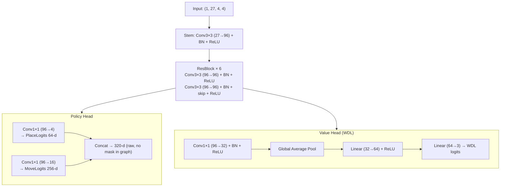

# 07. CPU / 強化学習の設計

## 1. 全体方針 — 盤面サイズ別の二系統

設計初期は「ユニバーサル CNN（4×4×27 入力）で 3x3 / 4x4 を単一モデルで扱う」方針だった。
実装と学習を進めた結果、**3x3 と 4x4 で別アルゴリズム** に分割する構成に切り替えた。

| 盤面 | アルゴリズム                                           | 学習 / モデル                  | 推論                               |
| ---- | ------------------------------------------------------ | ------------------------------ | ---------------------------------- |
| 3x3  | **alpha-beta + 反復深化 + Zobrist TT + PV/静的順序付** | 不要（オンライン探索のみ）     | TypeScript 直接実行（ONNX 不使用） |
| 4x4  | **AlphaZero 系（4x4 専用ネット + MCTS）**              | PyTorch + RTX 2080（自己対戦） | ONNX Runtime Web（遅延ロード）     |

### 1.1 ディスパッチ

`src/ai/worker/aiWorker.ts` が `state.rules.boardSize` で振り分け:

- `boardSize === 3` → `Solver3x3`（`src/ai/solver3x3.ts`）。ONNX セッション初期化なし。
- `boardSize === 4` → `InferenceEngine` + `MCTS`（`src/ai/inference.ts`, `src/ai/mcts.ts`）。
  ONNX モデルは **初回 4x4 リクエスト時に lazy load**。

`init` メッセージは即座に `ready` を返すため、ORT-Web / モデルファイルのロードに失敗しても 3x3 は遊べる。

### 1.2 なぜ 3x3 を AlphaZero から外したか

- 3x3 Gobblet は **後退解析で完全解析可能** だが、到達可能盤面 ~21B / テーブルベース ~4 GB と
  ブラウザに同梱できない規模（参考: <https://qiita.com/yasagureprog/items/94c0cb01005b2b94b837>）。
- 一方、**オンライン alpha-beta + TT** は 1 秒未満で十分強く、初手 L からの定跡級応手も
  時間予算内に到達する。配信バンドル増もゼロ。
- → 強化学習を 3x3 に投入する技術的必然性が消えた。4x4 にリソースを集中。

### 1.3 CPU 難易度（10 段階）

3x3 と 4x4 は **異なるパラメータ系** で 10 段階を派生させる。実装は `src/ai/difficulty.ts`。

#### 3x3 (`getProfile3x3`)

| 難易度 | `timeBudgetMs` | `mistakeRate` |
| ------ | -------------- | ------------- |
| 1      | 10 ms          | 0.7           |
| 2      | 20 ms          | 0.5           |
| 3      | 50 ms          | 0.3           |
| 4      | 100 ms         | 0.2           |
| 5      | 200 ms         | 0.1           |
| 6      | 500 ms         | 0.05          |
| 7      | 1 s            | 0.02          |
| 8      | 2.5 s          | 0             |
| 9      | 5 s            | 0             |
| 10     | 10 s           | 0             |

`mistakeRate` は **各ルート手選択で確率的に最善以外の合法手を採る**。Lv10 は実質的に完全解析級。

#### 4x4 (`getProfile`)

| 難易度 | MCTS sim 数 | 温度       |
| ------ | ----------- | ---------- |
| 1      | 20          | 1.5        |
| 2      | 50          | 1.3        |
| 3      | 100         | 1.1        |
| 4      | 150         | 1.0        |
| 5      | 250         | 0.85       |
| 6      | 400         | 0.7        |
| 7      | 600         | 0.5        |
| 8      | 1000        | 0.3        |
| 9      | 1500        | 0.15       |
| 10     | 3000        | 0 (greedy) |

単一の 4x4 ネット（後述）から sim 数 + 温度で派生。

---

## 2. 3x3: alpha-beta ソルバ

実装: `src/ai/solver3x3.ts` (`Solver3x3` クラス)。Worker からは `Solver3x3.selectMove(state, opts)` を呼ぶ。

### 2.1 構成要素

- **negamax + alpha-beta 枝刈り**
- **反復深化**（時間予算が尽きるまで深さを 1 ずつ伸ばす）
- **Zobrist ハッシュ + 置換表 (TT)**: `Map<bigint, {depth, flag, value, bestMoveIdx}>`、上限 1,000,000 エントリ
  - 連続呼び出し間で TT を保持して再利用
- **手順序付**:
  - root: PV（前 iteration の最善手）を最優先
  - 内部ノード: TT-best-move を最優先
  - 静的ヒューリスティック: 自分の 2 連完成 > 相手の 2 連阻止 > キャプチャ/リフト > 中央 > その他
- **make/unmake** をコンパクトな内部表現で in-place 実行（エンジンの clone-per-move コスト回避）
- **threefold repetition** と `maxPly` を漸進的に維持
- **協調的 abort**: `AbortSignal` を ID iteration 間と TT lookup 毎にチェック

### 2.2 性能

- 初手 L 系のラインで定跡級の応手まで時間予算内に到達することを実測で確認（`solver3x3.test.ts`）。
- メモリは TT 上限で固定。Lv10 (10 s) でも RTX 不要、ブラウザのメインスレッドの邪魔をしない。

---

## 3. 4x4: AlphaZero（4x4 専用ネット + MCTS）

学習パッケージ: `ai-training/src/dttt_train_4x4/`（旧ユニバーサル `dttt_train/` と並列に存在）。
旧パッケージは run01..run09 の再現用に残置。

### 3.1 ネットワーク構造（4x4 専用）

設計初期の 8×128ch ユニバーサルから縮小した **6 × ResBlock × 96 ch** トランクを採用。



アーキテクチャ定数（`ai-training/src/dttt_train_4x4/network.py`）:

```
INPUT_CHANNELS  : 27   # 互換のためユニバーサル encoding 形状を維持
TRUNK_CHANNELS  : 96
NUM_RES_BLOCKS  : 6
WDL_OUTPUTS     : 3    # Win / Draw / Loss（旧設計の tanh スカラから変更）
```

| ブロック     | パラメータ               |
| ------------ | ------------------------ |
| Stem         | 27 × 96 × 9 ≈ 23K        |
| ResBlock × 6 | 6 × 2 × 96 × 96 × 9 ≈ 1M |
| Heads        | 数千                     |
| **合計**     | **約 1.03M params**      |

**ONNX サイズ**: 約 **3.92 MB** (float32)。旧 8×128ch 構成 (~9.6 MB) の 0.41 倍。
`public/model.onnx` 現行配信は run11/step25000 のエクスポート (4.0 MB)。

### 3.2 入力テンソル: (1, 27, 4, 4)

旧ユニバーサル設計の 27 ch をそのまま流用。理由は v1 の TS 側 encoding + augmentation を再利用できる
（オービット計算のオフバイワン回避）。

| ch 範囲 | 内容                                                           |
| ------- | -------------------------------------------------------------- |
| 0–3     | P1 駒の **最上段** 位置（サイズ別 one-hot）                    |
| 4–7     | P2 駒の **最上段** 位置（サイズ別 one-hot）                    |
| 8–11    | P1 駒の **スタック内任意位置**（被覆含む、サイズ別）           |
| 12–15   | P2 駒の **スタック内任意位置**（同上）                         |
| 16–19   | P1 手駒残数（サイズ別、空間ブロードキャスト、正規化済み 0..1） |
| 20–23   | P2 手駒残数（同上）                                            |
| 24      | 手番（P1=1, P2=0）                                             |
| 25      | out-of-board mask（**4x4 では常時 0、退化チャネル**）          |
| 26      | unused-size mask（**4x4 では常時 0、退化チャネル**）           |

ch 25 / 26 は 4x4 では常に 0 で実質的に未使用だが、stem の追加重み 96 × 2 × 9 ≈ 1.7K は
全パラメータの ~0.07% で誤差。v2 で 25-ch 入力にリビジョンしてもよい。

### 3.3 行動空間とマスク

固定 320 次元（`PlaceFromReserve` 64 + `MoveOnBoard` 256）。
ONNX グラフ内には **マスクを含めない**（NaN 回避）。合法手マスクは TS 側 / Python 側で post-inference に適用。

### 3.4 学習エンジン（NumPy）

`dttt_train_4x4/engine.py` で **NumPy ベースの int8 board buffer + LUT cover-table** に書き換え。
旧 Python オブジェクト実装からの実測高速化:

| 操作                | 高速化倍率 |
| ------------------- | ---------- |
| `apply_move`        | 24×        |
| `_state_hash`       | 26×        |
| `legal_action_mask` | 11×        |
| 1 ゲーム自己対戦    | **3.1×**   |

CPU ワーカが GPU メインループを十分に追い越せるため、後述のとおり既定値を再設計した。

### 3.5 学習ハイパーパラメータ（4x4 専用 driver）

`ai-training/src/dttt_train_4x4/train.py` の既定値:

| 項目                            | 値              | 備考                                              |
| ------------------------------- | --------------- | ------------------------------------------------- |
| `--grad-mult`                   | **1.0**         | 旧 8（ユニバーサル driver）。リプレイ過学習を是正 |
| `--num-parallel`（GPU メイン）  | **64**          | 旧 256                                            |
| `--num-workers`（CPU 自己対戦） | **6**           | 旧 0。新エンジンで CPU 側を主データ源に           |
| `--batch-size`                  | 512             |                                                   |
| `--num-sims`                    | 200（既定）     | run12 では 400                                    |
| `--lr`                          | 2e-3（既定）    | run12 では 5e-4                                   |
| 最適化                          | AdamW (wd=1e-4) | linear warmup 500 steps + cosine annealing        |
| value target 混合 (Q_MIX)       | 0.25            | `target = 0.75 * z + 0.25 * q`                    |
| EMA decay (eval shadow)         | 0.999           |                                                   |
| リプレイ容量                    | **1,000,000**   | 旧 500K。CPU 自己対戦のスループット増に対応       |
| Dirichlet ノイズ                | α=0.3, ε=0.25   |                                                   |

旧ユニバーサル driver (`dttt_train.train`) と **重み非互換**。互換チェックエラーを返す。

### 3.6 学習 run の履歴

| Run       | 内容                                                                                                                        |
| --------- | --------------------------------------------------------------------------------------------------------------------------- |
| run01..09 | 旧ユニバーサル net (8×128ch) の試行。総じて棋力不足。再現性のためディスク残置                                               |
| run10     | 4x4 専用 net 初試行。**`--gating` ON が原因で apprentice deadlock**（後述）                                                 |
| run11     | run10/ckpt_002000 から **`--no-gating`** で再開。policy loss 4.1 → 2.5 / value loss 0.85 → 0.01（~23,000 steps）            |
| **run12** | **現在進行中**。run11/step25450 から `--num-sims 400 --max-sims 400 --lr 5e-4` で再開。run11 のキャパ依存プラトー打破を狙う |

#### 3.6.1 run10 の "apprentice deadlock"

`--gating` ON だと自己対戦は **凍結された step-2000 の "best" net** を使う。
候補ネットがその best を模倣する方向に収束し、上回れない（gating 0–40 / step 4000–8000）。
教師（凍結）と生徒（候補）が同レベルで握手して止まる現象。

**緩和**: run11 で `--no-gating` に切替。自己対戦は **EMA shadow**（候補を緩く追従）を使うため、
候補が伸びれば自己対戦相手も伸び、棋力が上昇方向に進む。loss 推移はそれを反映している。

### 3.7 量子化方針

float32 のまま 4 MB 以下で配信できるため、当面 int8 量子化は不要。
将来モバイルで推論レイテンシが問題になれば ONNX Runtime Web の動的 int8 量子化を検討。

---

## 4. 推論実装（共通）

### 4.1 ランタイム

- 4x4: **ONNX Runtime Web**（PyTorch → ONNX → ブラウザ最短経路、WASM/WebGPU 切替可）
- 3x3: ランタイム不要（純 TS）

### 4.2 ORT-Web の wasm パス固定

`src/ai/ortConfig.ts` で Vite の `?url` import を使い `ort.env.wasm.wasmPaths` を絶対 URL に固定する。
これがないと Vite の SPA フォールバックが wasm リクエストに対し HTML を返し、
"Wasm decoding failed: expected magic word" で初期化が落ちる。詳細は `10_risks.md` 参照。

### 4.3 MCTS（4x4）

- TypeScript 自前実装（`src/ai/mcts.ts`）
- PUCT、訪問回数 N / 累積価値 W / 事前確率 P / 子ノード参照
- 行動マスクは推論後に TS 側で `-Infinity` 加算 → softmax / argmax

### 4.4 ONNX 互換性の落とし穴（必読）

PyTorch → ONNX → ONNX Runtime Web の経路は罠が多い:

- **行動マスクを ONNX グラフに含めない**（`-∞ + softmax` の NaN 回避）。マスクは TS 側で適用
- **opset 17 固定**
- **BN は eval モードでエクスポート**（`model.eval()` 必須）
- **dynamic_axes 不使用**（入力 (1, 27, 4, 4) を固定）
- **3 経路パリティテスト**: PyTorch ↔ ONNX Runtime CPU ↔ ONNX Runtime Web で `max abs diff < 1e-4`

### 4.5 学習〜配信パイプライン

1. PyTorch で学習・チェックポイント保存
2. `dttt_train_4x4/export_onnx.py` で ONNX 化（`model.eval()` 必須）
3. opset 17 / dynamic_axes 不使用 で固定エクスポート
4. `public/model.onnx` に配置（現状: run11/step25000、4.0 MB）
5. クライアントは fetch + ONNX Runtime Web で読込（**初回 4x4 リクエスト時 lazy load**）

---

## 5. 参考リソース

- DeepMind AlphaZero 論文
- OpenSpiel（多数のゲーム実装）
- alpha-zero-general（汎用 AlphaZero 実装）
- ONNX Runtime Web 公式ドキュメント
- 3x3 Gobblet 後退解析: <https://qiita.com/yasagureprog/items/94c0cb01005b2b94b837>

---

## 付録 A. 旧設計（ユニバーサルネット）— 経緯

初期設計では `MAX_BOARD = 4` の固定形状入力 + 320 出力の **単一 CNN** で 3x3 / 4x4 両プリセットを扱う
方針だった（"ユニバーサルネットワーク方式"）。当時の想定:

- 入力 (1, 27, 4, 4)、3x3 のときは out-of-board / unused-size マスクで盤外と XL を不可侵化
- 8 × ResBlock × 128 ch トランク（~2.4M params, ONNX ~9.6 MB）
- 2 プリセットを 50/50 で混合自己対戦

run01..run09 で試行したが棋力が伸びず、最終的に **3x3 を解析的アプローチに切替** + **4x4 を専用ネットに縮小**
する現行構成に至った。退化チャネル (ch 25 / 26) と 320 次元行動空間は当時の名残。
